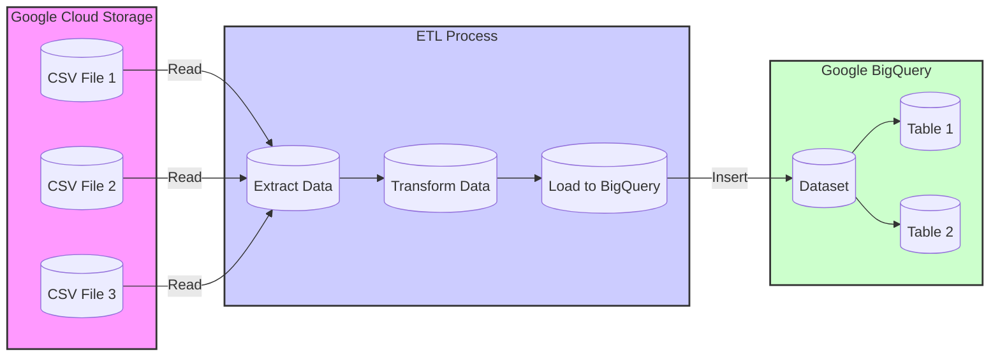

# Final Metadata Report

## Dataset Info
The dataset provides a comprehensive overview of various cell towers, encapsulating both technical specifications and performance metrics. Here's a high-level summary of the dataset's structure and the type of information it contains:

1. **Cell Tower ID**: This column uniquely identifies each cell tower in the dataset. It is likely alphanumeric and serves as the primary key for each row.

2. **Location**: This column specifies the geographical location of each cell tower. The data might include city, state, or more precise coordinates depending on the granularity required.

3. **Bandwidth Capacity (Gbps)**: This metric indicates the maximum data transmission capacity of each tower, measured in gigabits per second. It reflects the potential volume of data that can be handled by the tower.

4. **Frequency Band (GHz)**: This column shows the radio frequencies at which each cell tower operates, measured in gigahertz. Different frequency bands have different characteristics in terms of coverage area and penetration through obstacles.

5. **Technology Type**: This field describes the type of cellular technology used by the tower, such as 4G LTE, 5G NR, etc. This affects the speed, efficiency, and type of devices that can connect to the tower.

6. **Average Download Speed (Mbps)**: This column provides the average download speed achievable by users connected to the tower, measured in megabits per second. It is a critical performance indicator for end-user experience.

7. **Average Upload Speed (Mbps)**: Similar to download speed, this metric measures the average upload speed in megabits per second, which is essential for activities like video conferencing and uploading content to the internet.

8. **Number of Connected Devices**: This column records the average number of devices that are simultaneously connected to the tower. It provides insight into the load and usage level of the tower's resources.

9. **Energy Consumption (kWh)**: This metric shows the energy usage of each cell tower, measured in kilowatt-hours. It is crucial for assessing the environmental impact and operational costs of the cell tower infrastructure.

Overall, the dataset is structured to provide a detailed snapshot of the operational capabilities and performance of cell towers, which can be crucial for network management, planning, and optimization tasks. It can also be used to assess the quality of service provided to end-users and the sustainability aspects of the network infrastructure.

## Column Info
To provide detailed metadata for each column based on the provided information about a cell tower dataset, we need to define the attributes of each column clearly. This includes the data type, description, possible range or format, and any other relevant details. Here’s a breakdown for each column:

1. **Cell Tower ID**
   - **Data Type:** String or Integer
   - **Description:** A unique identifier assigned to each cell tower.
   - **Format/Example:** Could be numeric (e.g., 10001) or alphanumeric (e.g., CT10001).

2. **Location**
   - **Data Type:** String
   - **Description:** The physical location of the cell tower, typically described by the city, state, or specific coordinates.
   - **Format/Example:** "1234 Main St, Springfield, IL" or GPS coordinates "39.7817° N, 89.6501° W".

3. **Bandwidth Capacity (Gbps)**
   - **Data Type:** Float
   - **Description:** The maximum amount of data that can be transmitted from the tower in gigabits per second.
   - **Range:** Typically from 0.1 to 10 Gbps, depending on the tower's capabilities and technology.

4. **Frequency Band (GHz)**
   - **Data Type:** Float
   - **Description:** The operational frequency range of the tower in gigahertz.
   - **Range:** Common bands include 0.6 GHz (600 MHz), 1.8 GHz (1800 MHz), 2.3 GHz (2300 MHz), etc.

5. **Technology Type**
   - **Data Type:** String
   - **Description:** The type of cellular technology used by the tower, e.g., 4G LTE, 5G NR.
   - **Possible Values:** "4G", "4G LTE", "5G NR", "3G".

6. **Average Download Speed (Mbps)**
   - **Data Type:** Float
   - **Description:** The average download speed accessible to users connected to this tower, measured in megabits per second.
   - **Range:** 0 to 1000 Mbps, varying by technology and network conditions.

7. **Average Upload Speed (Mbps)**
   - **Data Type:** Float
   - **Description:** The average upload speed accessible to users connected to this tower, measured in megabits per second.
   - **Range:** 0 to 500 Mbps, typically lower than download speeds.

8. **Number of Connected Devices**
   - **Data Type:** Integer
   - **Description:** The total number of devices that are currently connected to the tower.
   - **Range:** 0 to several thousand, depending on the tower's capacity and area density.

9. **Energy Consumption (kWh)**
   - **Data Type:** Float
   - **Description:** The amount of energy consumed by the tower, measured in kilowatt-hours.
   - **Range:** Dependent on tower size, technology, and operational load. Could range from tens to thousands of kWh.

Each of these metadata entries helps in understanding the structure and expected data types and values in the dataset. This is crucial for data validation, processing, and analysis in any data-driven application or research.

## Data Lineage
To create a hypothetical data lineage diagram using Mermaid syntax, we'll assume a simple ETL (Extract, Transform, Load) process where data is extracted from CSV files stored in Google Cloud Storage (GCS), transformed using a data processing tool or script, and then loaded into Google BigQuery for analysis. Here's how you might represent this process in a Mermaid diagram:



### Explanation of the Diagram:
- **Google Cloud Storage (GCS)**: This is where the CSV files are stored. Each CSV file (CSV File 1, CSV File 2, CSV File 3) represents a node.
- **ETL Process**: This includes three stages:
  - **Extract**: Data is read from the CSV files.
  - **Transform**: Data is processed and transformed into a format suitable for analysis.
  - **Load**: The transformed data is loaded into Google BigQuery.
- **Google BigQuery (BQ)**: This is the destination for the processed data, where it is stored in a dataset that contains multiple tables (Table 1, Table 2).

### Styling:
- **Classes**: `storage`, `process`, and `database` are defined with different colors and styles to visually distinguish between storage locations, processing steps, and databases.

This diagram provides a clear, visual representation of the data flow from source to destination, highlighting the steps involved in the ETL process. Adjustments can be made to this basic template to reflect more complex processes or additional steps specific to a particular use case.

## Airflow Etl Pipeline
### Outline for an Airflow DAG to Automate ETL Pipeline from Google Cloud Storage to Google BigQuery

#### 1. **DAG Configuration**
   - **DAG ID:** `csv_to_bigquery_etl`
   - **Schedule:** Daily at a specified time (e.g., midnight UTC)
   - **Start Date:** Appropriate past date to cover data from the past year
   - **Catchup:** True (to process past data if the start date is before the current date)
   - **Default Arguments:**
     - `owner`: 'airflow'
     - `depends_on_past`: False
     - `email_on_failure`: True
     - `email_on_retry`: True
     - `retries`: 1
     - `retry_delay`: timedelta(minutes=5)
     - `project_id`: 'your-gcp-project-id'

#### 2. **Tasks Definition**
   - **Task 1: Check for New Files in GCS**
     - Operator: `GoogleCloudStoragePrefixSensor`
     - Description: Checks for the presence of new CSV files in a specified GCS bucket.

   - **Task 2: Load CSV Data from GCS to BigQuery Staging Table**
     - Operator: `GoogleCloudStorageToBigQueryOperator`
     - Description: Loads CSV files from GCS to a BigQuery staging table, handling schema detection automatically.

   - **Task 3: Data Transformation**
     - Operator: `BigQueryOperator`
     - Description: Executes SQL queries for data transformation and loads data into the final BigQuery table.
     - SQL Query: Transformation logic (e.g., aggregations, cleaning operations).

   - **Task 4: Data Quality Check**
     - Operator: `BigQueryCheckOperator`
     - Description: Performs data quality checks such as verifying there are no null values in essential columns.
     - SQL Check Query: `SELECT COUNT(*) FROM [TABLE] WHERE [COLUMN] IS NULL`

   - **Task 5: Data Lineage Tracking**
     - Operator: Custom Python Operator or use of external tools like Marquez or Apache Atlas.
     - Description: Logs metadata about the ETL process, including source, transformations applied, and destination details.

   - **Task 6: Alerting on Data Quality Issues**
     - Operator: Custom Python Operator
     - Description: Sends alerts (e.g., emails, Slack messages) if data quality checks fail.

   - **Task 7: Success/Failure Email Notification**
     - Operator: `EmailOperator`
     - Description: Sends an email notification upon successful or unsuccessful completion of the DAG.

#### 3. **Task Dependencies**
   - `Check for New Files in GCS` >> `Load CSV Data from GCS to BigQuery Staging Table`
   - `Load CSV Data from GCS to BigQuery Staging Table` >> `Data Transformation`
   - `Data Transformation` >> `Data Quality Check`
   - `Data Quality Check` >> `Data Lineage Tracking`
   - `Data Lineage Tracking` >> `Alerting on Data Quality Issues`
   - `Alerting on Data Quality Issues` >> `Success/Failure Email Notification`

#### 4. **Monitoring and Logging**
   - **Airflow's Built-in Monitoring:** Utilize Airflow's web server UI to monitor DAG runs and logs.
   - **Stackdriver Integration:** Integrate with Google Cloud's operations suite (formerly Stackdriver) for advanced monitoring and alerting.

#### 5. **Documentation and Maintenance**
   - **Documentation:** Maintain a detailed documentation of the DAG's purpose, data sources, transformation logic, and any dependencies.
   - **Maintenance Plan:** Regularly review and update the ETL pipeline as source data formats and business requirements change.

This outline provides a comprehensive framework for setting up an automated ETL pipeline using Apache Airflow, ensuring data quality, lineage tracking, and robust monitoring and alerting mechanisms.

## Airflow Etl Code
Below is a Python code snippet for an Apache Airflow DAG that automates the ETL process from CSV files in Google Cloud Storage (GCS) to a BigQuery table, following the specifications you provided. This code includes necessary imports, default arguments, and the DAG definition with the specified tasks.

```python
from datetime import datetime, timedelta
from airflow import DAG
from airflow.providers.google.cloud.operators.bigquery import BigQueryCheckOperator, BigQueryExecuteQueryOperator
from airflow.providers.google.cloud.transfers.gcs_to_bigquery import GCSToBigQueryOperator
from airflow.operators.dummy_operator import DummyOperator
from airflow.operators.email_operator import EmailOperator

# Default arguments for the DAG
default_args = {
    'owner': 'airflow',
    'depends_on_past': False,
    'email_on_failure': False,
    'email_on_retry': False,
    'retries': 3,
    'retry_delay': timedelta(minutes=5),
    'start_date': datetime(2023, 1, 1),
}

# Define the DAG
dag = DAG(
    dag_id='csv_to_bigquery_etl',
    default_args=default_args,
    description='ETL DAG from CSV in GCS to BigQuery',
    schedule_interval='0 0 * * *',  # Daily at midnight UTC
    catchup=False
)

# Task 1: Load CSV data from GCS to a BigQuery staging table
load_csv_to_bigquery = GCSToBigQueryOperator(
    task_id='load_csv_to_bigquery',
    bucket='your-gcs-bucket-name',
    source_objects=['path/to/your/file.csv'],
    destination_project_dataset_table='your-project.your-dataset.your_staging_table',
    schema_fields=[
        {'name': 'column1', 'type': 'STRING', 'mode': 'NULLABLE'},
        {'name': 'column2', 'type': 'INTEGER', 'mode': 'NULLABLE'},
        # Add schema fields as per your CSV structure
    ],
    write_disposition='WRITE_TRUNCATE',
    skip_leading_rows=1,
    source_format='CSV',
    google_cloud_storage_conn_id='google_cloud_default',
    bigquery_conn_id='google_cloud_default',
    dag=dag
)

# Task 2: Transform data in BigQuery
transform_data = BigQueryExecuteQueryOperator(
    task_id='transform_data',
    sql="""
        INSERT INTO your-project.your-dataset.your_final_table
        SELECT column1, column2, ... FROM your-project.your-dataset.your_staging_table
        WHERE conditions_if_any
    """,
    use_legacy_sql=False,
    bigquery_conn_id='google_cloud_default',
    dag=dag
)

# Task 3: Data quality check
data_quality_check = BigQueryCheckOperator(
    task_id='data_quality_check',
    sql="""
        SELECT COUNT(*) FROM your-project.your-dataset.your_final_table
        WHERE key_column IS NULL
    """,
    bigquery_conn_id='google_cloud_default',
    dag=dag
)

# Task 4: Alert on failure
alert_on_failure = EmailOperator(
    task_id='alert_on_failure',
    to='your-email@example.com',
    subject='Airflow Alert: Failure in CSV to BigQuery ETL',
    html_content="""<h3>ETL Task Failed</h3>""",
    dag=dag
)

# Setting up the task dependencies
load_csv_to_bigquery >> transform_data >> data_quality_check
data_quality_check >> alert_on_failure

# If any task fails, alert_on_failure will be triggered
for task in [load_csv_to_bigquery, transform_data, data_quality_check]:
    task.on_failure_callback = alert_on_failure.execute
```

### Notes:
1. **GCS Bucket and File Path**: Replace `'your-gcs-bucket-name'` and `'path/to/your/file.csv'` with your actual GCS bucket name and CSV file path.
2. **BigQuery Details**: Replace `'your-project.your-dataset.your_staging_table'` and `'your-project.your-dataset.your_final_table'` with your actual BigQuery project, dataset, and table names.
3. **Schema Fields**: Update the `schema_fields` in `load_csv_to_bigquery` to match the schema of your CSV file.
4. **SQL Transformations**: Modify the SQL query in `transform_data` as per your transformation requirements.
5. **Email Details**: Replace `'your-email@example.com'` with your actual email address for receiving alerts.

This DAG is designed to run daily, loading data from a CSV file in GCS to a staging table in BigQuery, transforming the data, performing a quality check, and sending an alert if any task fails. Adjust the configurations as necessary to fit your specific ETL requirements.

## Data Usage
Creating a data lineage diagram in Markdown can be challenging since Markdown itself does not support complex diagrams or graphics directly. However, you can use a combination of text and simple ASCII art to represent a basic data lineage diagram. Below is an example of how you might represent a simple data lineage flow in Markdown.

### Data Lineage Diagram Example

This example shows a basic data flow from source systems through a data warehouse to business intelligence reports.

```plaintext
+----------------+      +----------------+      +----------------+      +----------------+
|                |      |                |      |                |      |                |
|  Source System | ---> |  Staging Area  | ---> |  Data Warehouse | ---> |  BI Reports    |
|    (Database)  |      |   (ETL Process)|      |   (Aggregated   |      |  (Visualization|
|                |      |                |      |      Data)      |      |     Tools)     |
+----------------+      +----------------+      +----------------+      +----------------+
```

### Detailed View with Transformations

If you want to include more details, such as transformations or data processing steps, you can expand the diagram like this:

```plaintext
+----------------+      +----------------+      +----------------+      +----------------+      +----------------+
|                |      |                |      |                |      |                |      |                |
|  Source System | ---> |  Staging Area  | ---> |  Data Cleansing| ---> |  Data Warehouse | ---> |  BI Reports    |
|    (Database)  |      |   (Raw Import) |      |   (Transforms) |      |   (Aggregated   |      |  (Visualization|
|                |      |                |      |                |      |      Data)      |      |     Tools)     |
+----------------+      +----------------+      +----------------+      +----------------+      +----------------+
                         |                |      |                |
                         |  Data Quality  | ---> |  Data Enrichment|
                         |   (Checks)     |      |   (Add Context) |
                         +----------------+      +----------------+
```

### Notes:

1. **Source System**: This is where the data originates, often transactional databases.
2. **Staging Area**: Data is initially loaded here; often, minimal processing occurs.
3. **Data Cleansing**: Data is cleaned, validated, and possibly reformatted.
4. **Data Quality Checks**: Ensures data meets certain standards of quality.
5. **Data Enrichment**: Additional data (e.g., from other sources) is merged to enrich the dataset.
6. **Data Warehouse**: Data is stored in an organized manner, often optimized for query and analysis.
7. **BI Reports**: Data is visualized or reported for business decision-making.

This ASCII-style diagram can be included in your Markdown documents to help visualize data lineage in a simple and clear manner. For more complex diagrams, consider using specialized tools or software that supports detailed graphical representations, and then embed or link to those graphics in your Markdown file.

## Data Access Permissions
In a typical organization, access to data is structured according to the principles of least privilege and need-to-know, ensuring that individuals have access only to the data necessary for their job functions. This access is often segmented by role and responsibility, and managed through a combination of administrative controls, technical measures, and physical security. Here’s a breakdown of who might have access to data at different levels:

1. **Executive Management**:
   - **Access Level**: Read, some write, limited admin.
   - **Data Types**: Strategic data, financial reports, company-wide performance metrics.
   - **Restrictions**: Generally have broad access but may be restricted from accessing detailed personal employee data or sensitive operational data irrelevant to strategic decision-making.

2. **IT Administrators and System Operators**:
   - **Access Level**: Admin, read, write.
   - **Data Types**: System logs, user account information, network traffic data.
   - **Restrictions**: Access is controlled through administrative privileges; however, they are typically audited and monitored to prevent misuse of access rights.

3. **Human Resources**:
   - **Access Level**: Read, write, limited admin.
   - **Data Types**: Employee records, payroll data, benefits information.
   - **Restrictions**: Access is limited to personnel data and is often regulated under privacy laws like GDPR or HIPAA, depending on the nature of the data and jurisdiction.

4. **Departmental Managers**:
   - **Access Level**: Read, some write.
   - **Data Types**: Department-specific data such as team performance metrics, operational data, budgetary data.
   - **Restrictions**: Access is generally restricted to data relevant to their own department. They may not access data from other departments without explicit authorization.

5. **Finance Department**:
   - **Access Level**: Read, write, limited admin for senior roles.
   - **Data Types**: Financial records, procurement data, expense reports.
   - **Restrictions**: Access to sensitive financial data is tightly controlled and often subject to both internal audits and external regulatory compliance requirements.

6. **Regular Employees**:
   - **Access Level**: Read, some write.
   - **Data Types**: Personal employee data, project-related data.
   - **Restrictions**: Employees typically have access only to information directly relevant to their job tasks. Personal data access is restricted to their own information.

7. **Contractors and External Partners**:
   - **Access Level**: Controlled read, very limited write.
   - **Data Types**: Specific data necessary for the completion of their tasks.
   - **Restrictions**: Access is usually temporary and monitored closely. Contracts and agreements often include clauses to enforce data security and confidentiality.

8. **Legal and Compliance Teams**:
   - **Access Level**: Read, some write.
   - **Data Types**: Compliance reports, audit logs, legal documents.
   - **Restrictions**: Access is focused on ensuring regulatory compliance and handling legal issues, often requiring confidentiality agreements and special training.

**Common Restrictions and Privacy Considerations**:
- **Data Minimization**: Only the necessary amount of data is accessible to fulfill the required function.
- **Encryption**: Sensitive data is often encrypted both in transit and at rest.
- **Audit Trails**: Logs of who accessed what data and when, useful for compliance and monitoring.
- **Multi-Factor Authentication (MFA)**: Often required for accessing sensitive or critical data systems.
- **Data Masking and Anonymization**: Used particularly in development and testing environments to protect sensitive data.

Organizations must continuously evaluate and adjust access controls to adapt to changes in roles, responsibilities, and regulatory environments to ensure data security and compliance.

## Data Quality Metrics
Data validation rules, consistency checks, and data quality metrics are essential components of data management that ensure the reliability and usability of data. Below, I outline these elements along with common data quality issues that might arise.

### Data Validation Rules
Data validation rules are predefined criteria or sets of rules that help ensure the data entered into a system meets specific standards. Common validation rules include:

1. **Type Check**: Ensures data is of the correct data type (e.g., numeric, text, date).
2. **Range Check**: Verifies that data falls within a specified range (e.g., age must be between 0 and 120).
3. **Format Check**: Ensures data is formatted correctly (e.g., email addresses contain an "@" symbol and a domain).
4. **List Check**: Verifies data against a list of valid options (e.g., country names).
5. **Consistency Check**: Ensures data is logically consistent with other data (e.g., end date is after start date).
6. **Mandatory Fields**: Checks that all essential fields are filled in.
7. **Cross-Reference Check**: Ensures that related records in different tables or databases are consistent.

### Consistency Checks
Consistency checks are crucial for maintaining data integrity, especially in relational databases or when integrating multiple data sources. They include:

1. **Referential Integrity**: Ensures that foreign keys correctly refer to primary keys in related tables.
2. **Duplicate Check**: Identifies and prevents duplicate entries.
3. **Cross-System Consistency**: Ensures data across different systems remains consistent (e.g., customer information in CRM and billing systems).

### Data Quality Metrics
To measure and monitor the quality of data, several metrics are used:

1. **Completeness**: Measures the proportion of stored data against the potential of "100% complete". It identifies missing or null values.
2. **Uniqueness**: Ensures no data record is duplicated in a dataset.
3. **Accuracy**: Measures how closely data in the system reflects the true, real-world values.
4. **Timeliness**: Assesses whether data is up-to-date and available when needed.
5. **Consistency**: Checks whether the data does not contradict itself and remains aligned across different systems.
6. **Validity**: Measures data against business rules and constraints to ensure compliance.

### Common Data Quality Issues
Several issues can compromise data quality, including:

1. **Incomplete Data**: Missing values can lead to incorrect analysis and decision-making.
2. **Inaccurate Data**: Incorrect data entries caused by human error, misunderstanding, or system errors.
3. **Duplicate Data**: Redundant data entries can lead to inefficiency and confusion.
4. **Outdated Data**: Information that is not updated can become irrelevant, leading to poor decisions.
5. **Inconsistent Data**: Discrepancies in data across different systems or datasets can cause conflicts and errors in reporting.
6. **Non-conforming Data**: Data that does not adhere to specified formats or rules can lead to processing errors.

### Conclusion
Implementing robust data validation rules, consistency checks, and monitoring data quality metrics are fundamental practices to ensure high-quality data. Addressing common data quality issues proactively through regular audits, user training, and employing data cleansing tools can significantly enhance the reliability and effectiveness of data-driven decision-making.

## Performance Metrics
BigQuery, Google's fully managed, serverless data warehouse, is designed to handle large-scale data analytics efficiently. When working with BigQuery, several performance metrics are crucial to monitor and optimize to ensure efficient data processing and cost management. These include query performance and data refresh rates. Additionally, implementing strategic indexing and partitioning can significantly enhance performance. Below, we'll discuss these aspects in more detail.

### Query Performance

Query performance in BigQuery is primarily measured by how quickly and efficiently queries are executed. Key metrics include:

1. **Query Execution Time**: The total time taken from when a query is submitted until the results are returned. Faster execution times are generally preferred, indicating a more responsive data warehouse.

2. **Slot Utilization**: BigQuery processes queries using an allocation of computational resources known as slots. Monitoring slot utilization helps in understanding whether you have adequate resources for your workload or if you need to adjust your slot capacity.

3. **Bytes Processed**: This metric indicates the amount of data scanned by a query. Since BigQuery charges for the amount of data processed, optimizing queries to process fewer bytes can lead to cost savings.

4. **Cache Hit Rate**: BigQuery automatically caches query results for 24 hours. A high cache hit rate can significantly reduce the amount of data processed and improve query performance.

### Data Refresh Rates

Data refresh rate refers to how frequently data is updated or loaded into BigQuery. This metric is crucial for applications requiring near real-time data analysis. Performance considerations include:

1. **Data Ingestion Time**: The time it takes for data to be available in BigQuery after being ingested. Faster ingestion times are necessary for real-time analytics.

2. **Data Latency**: The delay between data creation in the source system and its availability in BigQuery. Lower latency is preferable for timely insights.

### Indexing and Partitioning Strategies

While BigQuery does not use traditional indexing like other databases, it supports partitioning and clustering, which can be used to optimize query performance:

1. **Partitioning**:
   - **Time-based Partitioning**: This involves dividing a table into segments based on timestamp columns. It's particularly useful for queries constrained to specific time ranges, reducing the amount of data scanned.
   - **Integer Range Partitioning**: Useful for datasets with a natural integer key, this strategy can help manage and query data more efficiently by dividing a table into ranges based on an integer column.

2. **Clustering**:
   - Tables can be clustered on one or more columns, which organizes data based on the values in the specified columns. This is beneficial for queries that filter or aggregate data on the clustering columns, as it reduces the amount of data scanned.

### Hypothetical Optimization Example

Consider a dataset containing sales data from a global company, updated every hour. To optimize query performance and manage costs effectively, you might:

- **Partition the table daily** based on the `sale_date` column. This would allow queries looking for sales on a specific day to scan only the relevant partition.
- **Cluster the table by `region` and `product_id`**. This setup would optimize queries filtering by these columns, as BigQuery would limit the data scan to relevant clusters.

By monitoring these performance metrics and applying appropriate partitioning and clustering strategies, you can significantly enhance the efficiency and cost-effectiveness of your BigQuery datasets.

## Cost Management
Google BigQuery is a fully-managed, serverless data warehouse that enables scalable analysis over petabytes of data. It is a powerful tool for data analysts, data scientists, and businesses who need to analyze large datasets quickly. However, managing costs in BigQuery is crucial as it operates on a pay-as-you-go model, where you are charged for the data stored, streamed, and queried.

### Cost Components in BigQuery

1. **Storage Costs:**
   - **Active Storage:** For data that is modified in the last 90 days. BigQuery charges a flat-rate of $0.020 per GB, per month.
   - **Long-term Storage:** For data that has not been modified for 90 consecutive days, the price automatically drops to $0.010 per GB, per month.

2. **Query Costs:**
   - BigQuery offers two pricing models for querying data: **on-demand** and **flat-rate**.
     - **On-demand pricing:** You pay for the amount of data processed by your queries. As of the last update, this is $5 per TB.
     - **Flat-rate pricing:** Offers a stable monthly cost with dedicated query processing capacity. This is suitable for businesses with high query loads and the need for predictable billing.

3. **Streaming Costs:**
   - If you are inserting data in real-time, BigQuery charges $0.010 per 200 MB of data inserted.

### Tips for Cost Optimization

#### 1. Optimize Data Storage
- **Partitioning:** Use partitioned tables based on time or other segmenting criteria, which can reduce the amount of data scanned by each query.
- **Clustering:** Implement clustering on your tables to organize data based on the contents of one or more columns. This can improve query performance and reduce costs by scanning fewer rows.
- **Delete or Archive Old Data:** Regularly delete or export old data that is no longer needed to cheaper storage solutions like Google Cloud Storage.

#### 2. Optimize Query Costs
- **Avoid SELECT *:** Query only the columns you need. SELECT * queries are more costly because they read all data.
- **Use Preview Options:** Use the BigQuery console or the `bq` command-line tool to preview data instead of running SELECT queries.
- **Materialized Views:** Use materialized views to precompute and store query results, which can be refreshed periodically. This is useful for repeated queries over the same data subset.
- **Nested and Repeated Fields:** Structure your data to minimize redundancy. Nested and repeated fields can help reduce the amount of data scanned.

#### 3. Monitor and Manage Query Performance
- **Query Cost Estimation:** Before running queries, use the BigQuery Query Validator to estimate costs.
- **Query Execution Details:** Review the query execution plan to understand how data is being processed and identify potential optimizations.
- **Caching:** BigQuery automatically caches query results for 24 hours unless the underlying data changes. Re-running the same query can retrieve results from the cache at no cost.

#### 4. Use Cost Controls
- **Set Budget Alerts:** Use Google Cloud's budget alerts to monitor your spending and get alerts when you approach your budget limit.
- **Use Quotas and Limits:** Apply quotas to control how much data your queries can process and limit unexpected high costs.

#### 5. Choose the Right Pricing Model
- Evaluate whether the on-demand or flat-rate pricing model suits your workload better. For predictable and consistent workloads, flat-rate pricing might offer better value.

By implementing these strategies, you can optimize your costs in BigQuery while maintaining efficient and powerful data analysis capabilities.

## Version Control
Implementing version control for datasets and SQL scripts is crucial for maintaining data integrity, tracking changes, and facilitating collaboration among team members. Here, we'll outline a hypothetical approach using Git, a widely used version control system, along with some best practices and tools that can help manage both datasets and SQL scripts effectively.

### 1. Version Control Setup

#### Git Repository Initialization
- **Create a Git repository**: Initialize a Git repository in your project directory. This repository will be used to track changes to SQL scripts and potentially changes to dataset metadata or small data files.
  
  ```bash
  git init
  ```

#### Directory Structure
- **Organize directories**: Create separate directories for SQL scripts and datasets to keep the repository organized.
  ```
  /project-root
    /data
    /scripts
  ```

### 2. Managing SQL Scripts

SQL scripts are text-based and can be directly managed with Git, which is ideal for tracking changes, reviewing code, and reverting to previous versions.

- **Committing changes**: Regularly commit changes to your SQL scripts with descriptive commit messages. This practice helps in documenting what changes were made and why.
  
  ```bash
  git add scripts/example.sql
  git commit -m "Add new queries for customer segmentation"
  ```

- **Branching**: Use branches to manage different development streams. For example, use a `develop` branch for ongoing work and a `master` or `main` branch for stable versions.
  
  ```bash
  git checkout -b feature/new-reporting
  ```

- **Code review and merging**: Use pull requests (PRs) for code reviews before merging changes into the main branch. This ensures that all SQL scripts are reviewed and tested, reducing the risk of errors.

### 3. Managing Datasets

Handling large datasets in Git can be challenging due to size limitations and inefficiency in tracking binary files. Here are some strategies:

#### Lightweight Dataset Tracking
- **Use `.gitignore`**: Avoid committing large data files directly to Git. Instead, include data directories in `.gitignore`.
  
  ```
  # .gitignore
  data/*
  ```

- **Metadata and small data files**: Commit small data files or metadata (like data schemas or summaries) that describe or configure datasets.

#### External Storage Solutions
- **Git Large File Storage (LFS)**: Use Git LFS to track large datasets. It replaces large files such as data sets with text pointers inside Git, while storing the file contents on a remote server.
  
  ```bash
  git lfs install
  git lfs track "*.csv"
  git add .gitattributes
  ```

- **Data Version Control (DVC)**: Consider using DVC, an open-source tool designed to handle large files, data sets, machine learning models, etc. DVC works alongside Git to manage data and model files separately but synchronously.
  
  ```bash
  dvc init
  dvc add data/large-dataset.csv
  git add data/.gitignore data/large-dataset.csv.dvc
  git commit -m "Track large dataset with DVC"
  ```

### 4. Collaboration and Backup

- **Remote repositories**: Push the local Git repository to a remote server (like GitHub, GitLab, or Bitbucket) to backup your work and collaborate with others.
  
  ```bash
  git remote add origin <repository-url>
  git push -u origin main
  ```

- **Access control**: Manage access to the repository to control who can read from or write to the repository, ensuring data security and integrity.

### 5. Automation and Integration

- **Continuous Integration (CI)**: Set up CI pipelines to automatically run tests on your SQL scripts or data validation checks whenever changes are pushed to the repository.

- **Automated backups**: Configure automated backups for the data storage, especially when using external tools like DVC or Git LFS.

### Conclusion

By using Git in conjunction with tools like Git LFS or DVC, you can effectively manage both SQL scripts and datasets. This approach not only leverages the power of version control for source code but also adapts it to handle data, ensuring that all aspects of your project are tracked, versioned, and reviewed.

## Data Refresh Schedules
An ETL (Extract, Transform, Load) job schedule is crucial for maintaining the accuracy and relevance of data in a data warehouse or any other data storage system. The schedule depends on the nature of the business, the data sources, and the specific requirements of the stakeholders. Below, I will outline a typical ETL job schedule for refreshing a dataset, including refresh frequencies and handling the last updated timestamp.

### 1. **Understanding the Data Sources**
   - **Transactional Databases**: Data from operational systems like sales, customer management, etc.
   - **External Data Sources**: Data from third-party APIs, external databases, etc.
   - **Internal Data Logs**: Server logs, application logs, etc.

### 2. **Defining Refresh Frequencies**
   - **Real-time**: For highly dynamic data where updates are critical, such as stock prices or real-time analytics. ETL processes are triggered by event streams.
   - **Near Real-Time (Micro-batches)**: Data is refreshed every few minutes, suitable for fast-moving data that does not require instant updates.
   - **Hourly**: Common for operational reporting where data freshness is important but not critical.
   - **Daily**: Most common frequency for a wide range of business needs, balancing between performance and freshness.
   - **Weekly/Monthly**: Suitable for data that changes less frequently, such as summary reports, aggregated metrics, etc.

### 3. **ETL Job Schedule Example**
   - **0:00 AM**: Daily ETL job kicks off to process the previous day's data.
   - **Every Hour**: Hourly jobs run to update certain operational data.
   - **Every 5 Minutes**: Micro-batch jobs update near real-time dashboards.
   - **On-demand**: Trigger-based ETL processes for critical business events.

### 4. **Handling Last Updated Timestamp**
   - **Extract Phase**: Capture the last updated timestamp from each source system. This might involve system timestamps or custom fields maintained in the source databases.
   - **Transform Phase**: Use the timestamp to filter and process only the records that have changed since the last ETL run. This approach minimizes the volume of data processed and helps in maintaining data consistency.
   - **Load Phase**: Update the data warehouse/data lake with the new or changed data along with the timestamp of the last update. This timestamp becomes crucial for the next ETL cycle to determine the delta (changes since the last update).

### 5. **Monitoring and Logging**
   - **Success and Failure Logs**: Track each ETL job's success or failure status.
   - **Performance Metrics**: Monitor the time taken for each phase of the ETL and optimize as necessary.
   - **Alerts**: Set up alerts for failures or performance degradation.

### 6. **Maintenance and Optimization**
   - **Regular Reviews**: Periodically review the ETL processes to ensure they meet business needs and make adjustments as data sources or business requirements change.
   - **Optimization**: Continuously optimize the ETL processes for performance, such as by refining data models, indexing, or query tuning.

### 7. **Documentation**
   - Maintain detailed documentation of all ETL processes, including data sources, transformation logic, dependencies, and refresh schedules. This documentation is vital for troubleshooting, audits, and onboarding new team members.

By setting up a well-defined ETL job schedule and handling the last updated timestamps efficiently, organizations can ensure that their data remains fresh, accurate, and reliable, supporting timely insights and decision-making.

## Change Management
Implementing a robust change management process for managing datasets, including schema changes or data updates, is crucial for maintaining data integrity, ensuring data quality, and supporting the seamless operation of data-driven applications. Below is a detailed outline of a change management process tailored for dataset management:

### 1. Change Identification
- **Purpose**: Identify the need for a change in the dataset or schema based on new requirements, errors, or enhancements.
- **Responsibility**: Data owners, data users, or system analysts.
- **Action**: Document the proposed change, detailing the current state, the proposed state, and the reason for the change.

### 2. Change Request Submission
- **Purpose**: Formally initiate a request for change.
- **Responsibility**: Stakeholder submits a change request.
- **Action**: Fill out a change request form on a tracking system (e.g., JIRA, ServiceNow). [Hypothetical Link to Change Request Form](http://example.com/change-request)

### 3. Change Review
- **Purpose**: Evaluate the impact, feasibility, and benefits of the proposed change.
- **Responsibility**: Change Advisory Board (CAB) consisting of data architects, database administrators, and business analysts.
- **Action**: Review the change request details, assess impacts on related systems, and approve, reject, or request additional information.

### 4. Change Planning
- **Purpose**: Plan the implementation of the change.
- **Responsibility**: Project managers and data engineers.
- **Action**: Develop a detailed plan including timelines, resources needed, testing plans, and rollback procedures.

### 5. Change Testing
- **Purpose**: Ensure the change meets requirements without affecting existing functionalities.
- **Responsibility**: Quality assurance (QA) team and data testers.
- **Action**: Implement the change in a testing environment, conduct thorough testing (unit tests, integration tests, performance tests), and document the results.

### 6. Stakeholder Approval
- **Purpose**: Obtain final approval from stakeholders based on the testing results and impact assessments.
- **Responsibility**: CAB and project sponsors.
- **Action**: Review testing and impact assessment reports, and give final approval or feedback.

### 7. Change Implementation
- **Purpose**: Deploy the change to the production environment.
- **Responsibility**: Data engineers and IT operations.
- **Action**: Schedule and execute the change deployment during approved maintenance windows, following the detailed plan and using automation tools where possible.

### 8. Post-Implementation Review
- **Purpose**: Verify that the change has been implemented correctly and is functioning as expected.
- **Responsibility**: QA team and data users.
- **Action**: Monitor data and system performance, verify functionality, and collect feedback from users.

### 9. Documentation and Closure
- **Purpose**: Document the entire process and formally close the change request.
- **Responsibility**: Project manager and documentation specialists.
- **Action**: Update system and user documentation, archive all relevant materials, and update the change management tracking system to reflect the completed status.

### 10. Continuous Improvement
- **Purpose**: Learn from each change process and improve future change management practices.
- **Responsibility**: CAB and continuous improvement teams.
- **Action**: Review what went well and what could be improved, update change management policies and procedures accordingly.

### Tools and Systems
- **Change Management Tracking**: JIRA, ServiceNow, or a similar tool to track and manage change requests.
- **Documentation**: Confluence, SharePoint, or similar for maintaining documentation.
- **Testing and Deployment**: Automated testing tools and CI/CD pipelines for efficient handling of changes.

By following this structured approach, organizations can manage changes to their datasets effectively, minimizing risks and disruptions while maximizing data quality and value.

## Business Context
### Hypothetical Business Context: Online Retail Company

#### Business Overview:
The company, "E-Shop Trendz," is an online retailer specializing in consumer electronics and fashion accessories. The business operates globally, offering a wide range of products from smartphones and laptops to watches and jewelry. E-Shop Trendz prides itself on its customer-centric approach, leveraging data to enhance user experience, optimize operations, and drive sales.

#### Dataset Overview:
The dataset in question contains detailed transaction records for the past two years. Key data points include:

- **Transaction ID**: Unique identifier for each sale.
- **Product ID**: Identifier for each product sold.
- **Product Category**: Type of product (e.g., electronics, accessories).
- **Quantity Sold**: Number of units sold per transaction.
- **Transaction Date**: Date and time of each sale.
- **Customer ID**: Unique identifier for each customer.
- **Price per Unit**: Selling price of each product per unit.
- **Customer Demographics**: Age, location, gender, etc.
- **Sales Channel**: Online platform used (e.g., website, mobile app).

#### Relevance to Business Processes:

1. **Inventory Management**:
   - **Data Utilized**: Product ID, Quantity Sold, Transaction Date.
   - **Business Process**: Monitoring stock levels, predicting future demand, optimizing restocking strategies.

2. **Customer Relationship Management (CRM)**:
   - **Data Utilized**: Customer ID, Transaction History, Customer Demographics.
   - **Business Process**: Personalizing marketing efforts, improving customer service, enhancing customer retention and loyalty.

3. **Sales Strategy**:
   - **Data Utilized**: Product Category, Price per Unit, Sales Channel, Transaction Date.
   - **Business Process**: Adjusting pricing strategies, choosing promotional tactics, selecting optimal sales channels.

4. **Market Analysis**:
   - **Data Utilized**: Product Category, Quantity Sold, Customer Demographics.
   - **Business Process**: Identifying market trends, understanding consumer behavior, tailoring product offerings.

#### Decision-Making Enhancement:
- **Pricing Decisions**: Analyzing historical sales data to determine price sensitivity and optimize pricing to maximize profits.
- **Marketing Campaigns**: Using customer demographic data and purchase history to tailor marketing messages and target the right audience effectively.
- **Product Development**: Identifying trending products and categories to focus on developing new offerings or improving existing ones.

#### Key Performance Indicators (KPIs):
1. **Sales Growth**: Measured by the increase in total sales revenue over a specific period.
2. **Customer Lifetime Value (CLV)**: Calculated based on the total value a customer is expected to spend over their lifetime.
3. **Inventory Turnover Ratio**: Indicates how often inventory is sold and replaced over a period.
4. **Customer Acquisition Cost (CAC)**: The cost associated with convincing a customer to buy a product/service.
5. **Return on Advertising Spend (ROAS)**: Measures the effectiveness of advertising campaigns in generating sales.

### Conclusion:
The dataset is integral to "E-Shop Trendz" as it supports critical business functions such as inventory management, customer relationship management, sales strategy formulation, and market analysis. By effectively analyzing this data, the company can make informed decisions that enhance operational efficiency, improve customer satisfaction, and ultimately drive profitability.

## Compliance Security
When managing datasets, especially those containing sensitive or personal information, it is crucial to adhere to stringent compliance and security measures. These measures are guided by data governance policies and security practices that aim to protect data integrity, confidentiality, and availability. Here’s a detailed discussion on how to ensure compliance and implement security measures for a dataset:

### 1. **Understanding Compliance Requirements**
   - **Data Protection Regulations**: Identify and understand the regulations that apply to the dataset, such as GDPR (General Data Protection Regulation) in Europe, HIPAA (Health Insurance Portability and Accountability Act) in the United States, or other national data protection laws.
   - **Industry-Specific Regulations**: Depending on the dataset's nature, other regulations like PCI-DSS for payment data, or FERPA for educational records might apply.
   - **Contractual Obligations**: Review any agreements or contracts that dictate specific data handling and security requirements.

### 2. **Data Classification**
   - **Identify Data Sensitivity**: Classify data based on sensitivity and the impact of its exposure. Common classifications include public, internal, confidential, and restricted.
   - **Access Controls**: Based on classification, implement strict access controls ensuring that only authorized personnel have access to sensitive data.

### 3. **Data Security Measures**
   - **Encryption**: Encrypt data at rest and in transit to protect against unauthorized access. Use strong encryption standards such as AES-256.
   - **Data Masking and Anonymization**: For data that will be used in less secure or public environments, consider techniques like data masking or anonymization to protect personal or sensitive information.
   - **Secure Data Storage**: Use secure servers and storage solutions. Ensure physical security for on-premises storage and vet cloud storage providers for compliance with relevant standards.

### 4. **Data Access Controls**
   - **Authentication and Authorization**: Implement robust authentication mechanisms (e.g., multi-factor authentication) and ensure that authorization practices follow the principle of least privilege.
   - **User Role Management**: Define roles clearly and assign permissions based on these roles. Regularly review and adjust these permissions as necessary.

### 5. **Audit and Monitoring**
   - **Activity Logs**: Maintain detailed logs of data access and modifications. Ensure that logs are immutable and stored securely.
   - **Regular Audits**: Conduct regular audits to ensure compliance with policies and regulations. Audits can be internal or conducted by external bodies.
   - **Continuous Monitoring**: Implement tools for real-time monitoring of data access and anomaly detection to quickly identify and respond to potential security incidents.

### 6. **Incident Response and Data Breach Management**
   - **Incident Response Plan**: Develop and regularly update an incident response plan. This plan should include procedures for containment, investigation, and notification in the event of a data breach.
   - **Breach Notification**: Be aware of and comply with data breach notification laws applicable to the jurisdiction, ensuring timely notification to authorities and affected individuals.

### 7. **Data Retention and Disposal**
   - **Data Retention Policy**: Define how long different types of data will be retained based on legal and operational requirements.
   - **Secure Data Disposal**: When data is no longer needed, ensure it is disposed of securely to prevent unauthorized access. This includes physical media destruction and secure deletion of digital data.

### 8. **Training and Awareness**
   - **Regular Training**: Conduct regular training sessions for employees on data protection best practices and the importance of compliance.
   - **Awareness Programs**: Keep data security as a topic of regular discussion within the organization to maintain awareness and vigilance.

### 9. **Documentation and Policy Management**
   - **Document Policies and Procedures**: Clearly document all data governance policies and security procedures. Regularly review and update these documents to adapt to new threats or changes in compliance requirements.
   - **Policy Enforcement**: Ensure that policies are enforced and that violations are handled consistently to maintain the integrity of data governance efforts.

By implementing these compliance and security measures, organizations can protect their datasets from unauthorized access and misuse, thereby upholding their legal obligations and maintaining trust with stakeholders.

## Recommendations
To provide comprehensive suggestions for potential improvements or optimizations to the dataset or ETL (Extract, Transform, Load) process, it's important to consider several factors including the nature of the data, the current architecture, the tools being used, and the specific upcoming changes or enhancements. Here are some general recommendations that can be tailored to fit specific scenarios:

### 1. Data Quality and Integrity
- **Automated Data Quality Checks:** Implement automated scripts or tools to check for data quality issues such as duplicates, missing values, or incorrect data formats during the ETL process.
- **Data Validation Rules:** Define and enforce stricter data validation rules during the extraction and loading phases to ensure that the data conforms to expected formats and ranges.

### 2. Performance Optimization
- **Parallel Processing:** Utilize parallel processing capabilities to speed up the ETL process. This can be particularly effective during the transformation phase where operations can be CPU-intensive.
- **Incremental Loading:** Instead of reloading the entire dataset, consider implementing incremental data loading techniques to process only new or changed data.
- **Optimize Queries:** Analyze and optimize SQL or data manipulation queries to reduce execution time and resource consumption.

### 3. Scalability and Flexibility
- **Scalable Infrastructure:** Use cloud services like AWS, Azure, or Google Cloud that can dynamically allocate resources based on the workload, which is crucial for handling large datasets or variable loads.
- **Containerization:** Use Docker or Kubernetes to containerize the ETL jobs, making them more portable and easier to scale.

### 4. Advanced Data Processing Techniques
- **Real-time Processing:** If the business requires near real-time data, consider using stream processing frameworks like Apache Kafka, Apache Storm, or Apache Flink.
- **Data Lake:** Consider setting up a data lake to store raw data in its native format, allowing for more flexible schemas and the ability to process unstructured data.

### 5. Data Security and Compliance
- **Encryption:** Implement encryption at rest and in transit to secure sensitive data.
- **Access Controls:** Define and enforce strict access controls and audit logs to ensure that only authorized personnel can access or modify the ETL processes and data.

### 6. Monitoring and Logging
- **ETL Monitoring Tools:** Use tools like Apache Airflow, AWS Glue, or custom dashboards to monitor the health and performance of ETL processes.
- **Logging:** Enhance logging mechanisms to capture detailed information about the ETL process, which can be crucial for debugging and optimizing the process.

### 7. Documentation and Version Control
- **Documentation:** Maintain thorough documentation of the ETL process, including data sources, transformation rules, dependencies, and schedules.
- **Version Control:** Use version control systems for ETL scripts and configurations to track changes and facilitate collaboration among team members.

### 8. Machine Learning and AI Integration
- **Predictive Analytics:** Integrate machine learning models to predict trends and anomalies in your data, which can enhance decision-making processes.
- **Automated Decision Making:** Use AI to automate certain decision-making processes within the ETL workflow, such as dynamic error handling or adaptive data cleansing techniques.

### 9. Feedback Loop
- **Continuous Feedback:** Establish a feedback loop with end-users and stakeholders to continuously gather insights on the data quality, relevance, and ETL performance, and use this feedback to make iterative improvements.

By considering these suggestions and tailoring them to the specific needs and upcoming changes in your organization, you can significantly enhance the efficiency, reliability, and scalability of your ETL processes and datasets.

*This report is generated in markdown format for better readability.*
