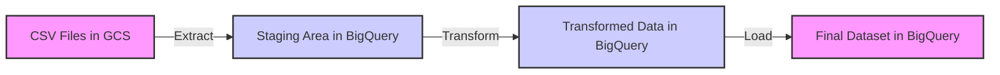

# Final Metadata Report

## Dataset Info
The dataset provides a comprehensive overview of various cell towers, encapsulating both technical specifications and performance metrics. Here's a high-level summary of the dataset's structure and the type of information it contains:

1. **Cell Tower ID**: This column contains unique identifiers for each cell tower, allowing for individual tracking and data analysis.

2. **Location**: This column specifies the geographical location of each cell tower, which could be useful for analyzing coverage and performance across different areas.

3. **Bandwidth Capacity (Gbps)**: This metric indicates the maximum data transmission capacity of each tower, which is crucial for understanding potential data throughput and network congestion.

4. **Frequency Band (GHz)**: This shows the radio frequencies at which each cell tower operates, affecting the tower's range and penetration capabilities.

5. **Technology Type**: This column details the type of cellular technology used by each tower (e.g., 4G LTE, 5G NR), which impacts the speed and efficiency of the network.

6. **Average Download Speed (Mbps)**: This provides insights into the real-world download speeds users can expect when connected to each tower, a key performance indicator.

7. **Average Upload Speed (Mbps)**: Similar to download speeds, this measures the upload capabilities of each tower, important for applications requiring data to be sent from the user's device.

8. **Number of Connected Devices**: This column records the number of devices that are typically connected to each tower simultaneously, reflecting the tower's load and usage levels.

9. **Energy Consumption (kWh)**: This measures the energy usage of each cell tower, offering data that can be crucial for assessing operational efficiency and environmental impact.

Overall, this dataset is well-suited for detailed analysis of network performance, operational efficiency, and technological deployment across different locations. It can be used by network operators to optimize their services, by policymakers for regulatory and planning purposes, or by researchers studying telecommunications infrastructure.

## Column Info
To provide detailed metadata for each column based on the provided information about a cell tower dataset, we need to define the attributes of each column such as data type, description, possible values, and constraints. Here's a breakdown for each column:

1. **Cell Tower ID**
   - **Data Type:** String or Integer
   - **Description:** A unique identifier assigned to each cell tower.
   - **Possible Values:** Alphanumeric (e.g., "CT1001") or numeric sequence (e.g., 1001).
   - **Constraints:** Must be unique; not null.

2. **Location**
   - **Data Type:** String
   - **Description:** The physical location of the cell tower, typically described by the city, state, or specific coordinates.
   - **Possible Values:** Textual description (e.g., "New York, NY" or "34.0522° N, 118.2437° W").
   - **Constraints:** Not null.

3. **Bandwidth Capacity (Gbps)**
   - **Data Type:** Float
   - **Description:** The maximum data transmission capacity of the cell tower in gigabits per second.
   - **Possible Values:** Numeric value (e.g., 1.5, 10.0).
   - **Constraints:** Greater than 0; not null.

4. **Frequency Band (GHz)**
   - **Data Type:** Float
   - **Description:** The frequency range at which the cell tower operates, measured in gigahertz.
   - **Possible Values:** Numeric value (e.g., 1.8, 2.4).
   - **Constraints:** Not null.

5. **Technology Type**
   - **Data Type:** String
   - **Description:** The type of cellular technology used by the tower (e.g., 4G, 5G).
   - **Possible Values:** "2G", "3G", "4G", "5G", etc.
   - **Constraints:** Not null.

6. **Average Download Speed (Mbps)**
   - **Data Type:** Float
   - **Description:** The average download speed provided by the cell tower, measured in megabits per second.
   - **Possible Values:** Numeric value (e.g., 20.0, 100.0).
   - **Constraints:** Greater than 0; not null.

7. **Average Upload Speed (Mbps)**
   - **Data Type:** Float
   - **Description:** The average upload speed provided by the cell tower, measured in megabits per second.
   - **Possible Values:** Numeric value (e.g., 10.0, 50.0).
   - **Constraints:** Greater than 0; not null.

8. **Number of Connected Devices**
   - **Data Type:** Integer
   - **Description:** The total number of devices currently connected to the cell tower.
   - **Possible Values:** Numeric value (e.g., 100, 500).
   - **Constraints:** Greater than or equal to 0; not null.

9. **Energy Consumption (kWh)**
   - **Data Type:** Float
   - **Description:** The amount of energy consumed by the cell tower, measured in kilowatt-hours.
   - **Possible Values:** Numeric value (e.g., 250.0, 1000.0).
   - **Constraints:** Greater than 0; not null.

These metadata definitions help in understanding the structure and constraints of the data, which is crucial for data management, quality control, and analysis.

## Data Lineage
To create a hypothetical data lineage diagram using Mermaid syntax for a simple ETL process that moves data from CSV files in Google Cloud Storage (GCS) to BigQuery, we need to outline the flow of data from the source to the destination, including any intermediate steps such as data transformation or loading processes.

Here's a basic example of how you might structure this diagram:



### Explanation of the Diagram:
- **CSV Files in GCS**: This is the initial data source where the CSV files are stored.
- **Staging Area in BigQuery**: After extracting data from GCS, it is initially loaded into a staging area in BigQuery. This is typically a raw, untransformed copy of the data.
- **Transformed Data in BigQuery**: Represents the data after it has undergone necessary transformations (e.g., cleaning, normalization, aggregation).
- **Final Dataset in BigQuery**: This is the final output where the data is stored in its usable form for analysis or querying.

### Styling:
- **storage**: Nodes that represent data storage points are styled with a light pink fill.
- **process**: Nodes that represent processes (like transformation) are styled with a light blue fill.

This diagram is quite simplified and ideal for illustrating basic ETL processes. Depending on the complexity of your actual data workflows, you might need to add more nodes to represent additional steps such as data validation, error handling, or more complex transformations.

## Airflow Etl Pipeline
### Outline for an Airflow DAG to Automate ETL Pipeline from Google Cloud Storage to Google BigQuery

#### 1. Introduction
   - **Objective**: Automate the extraction, transformation, and loading (ETL) of data from CSV files stored in Google Cloud Storage into Google BigQuery.
   - **Frequency**: Daily execution of the DAG.
   - **Data Scope**: Process data covering the past year.

#### 2. DAG Configuration
   - **DAG ID**: `etl_csv_to_bigquery`
   - **Schedule**: Daily at a specified time (e.g., 1:00 AM UTC).
   - **Start Date**: Appropriate start date considering data availability.
   - **Catchup**: False (to prevent backfilling if DAG is turned off and on).
   - **Default Arguments**:
     - Retries
     - Retry delay
     - Email on failure
     - Email on retry
     - Failure callback

#### 3. Tasks in the DAG
   - **Task 1: Check for New Files**
     - Operator: `PythonOperator`
     - Description: Check Google Cloud Storage for new CSV files based on the last modified date.

   - **Task 2: Extract Data**
     - Operator: `GoogleCloudStorageToBigQueryOperator`
     - Description: Extract CSV files from Google Cloud Storage and load them into a staging table in BigQuery.

   - **Task 3: Transform Data**
     - Operator: `BigQueryOperator`
     - Description: Apply SQL transformations to clean and structure the data appropriately. This may include filtering data for the past year and other transformations as required.

   - **Task 4: Data Quality Check**
     - Operator: `PythonOperator`
     - Description: Perform data quality checks such as verifying there are no null values in essential columns. This can be implemented using SQL queries that count nulls and raise exceptions if the quality checks fail.

   - **Task 5: Load to Production Table**
     - Operator: `BigQueryOperator`
     - Description: Load the transformed data into the production table.

   - **Task 6: Track Data Lineage**
     - Operator: `PythonOperator`
     - Description: Log metadata about the ETL process, including source file names, timestamps, row counts, and transformation specifics to maintain data lineage.

#### 4. Monitoring and Alerting
   - **Setup Monitoring**: Utilize Airflow's built-in email alerting to send notifications in case of task failures or retries.
   - **Custom Alerts**: Implement custom alerts for specific data quality issues detected during the Data Quality Check task.
   - **Logging**: Ensure detailed logging for each task to aid in debugging and tracking the pipeline's execution history.

#### 5. Dependencies Between Tasks
   - `Check for New Files` >> `Extract Data`
   - `Extract Data` >> `Transform Data`
   - `Transform Data` >> `Data Quality Check`
   - `Data Quality Check` >> `Load to Production Table`
   - `Load to Production Table` >> `Track Data Lineage`

#### 6. Additional Considerations
   - **Scalability**: Ensure the DAG is scalable to handle increases in data volume.
   - **Error Handling**: Implement comprehensive error handling and retry mechanisms.
   - **Security**: Manage credentials securely using Airflow's connections and secrets management.
   - **Documentation**: Maintain thorough documentation for the DAG and all SQL transformations.

#### 7. Conclusion
   - Recap of the DAG's purpose and its components.
   - Mention potential future improvements or extensions to the pipeline.

This outline provides a structured approach to building an Airflow DAG for automating a robust ETL pipeline from Google Cloud Storage to Google BigQuery, ensuring data quality, lineage tracking, and operational monitoring.

## Airflow Etl Code
Below is a Python code snippet for an Apache Airflow DAG that automates the ETL process from CSV files in Google Cloud Storage (GCS) to a BigQuery table, following the specifications you provided. This code includes necessary imports, default arguments, and the DAG definition with the specified tasks.

```python
from datetime import datetime, timedelta
from airflow import DAG
from airflow.providers.google.cloud.transfers.gcs_to_bigquery import GCSToBigQueryOperator
from airflow.providers.google.cloud.operators.bigquery import BigQueryExecuteQueryOperator, BigQueryCheckOperator
from airflow.operators.email_operator import EmailOperator
from airflow.operators.dummy_operator import DummyOperator

# Default arguments for the DAG
default_args = {
    'owner': 'airflow',
    'start_date': datetime(2023, 1, 1),
    'retries': 3,
    'retry_delay': timedelta(minutes=5),
    'email_on_failure': False,
    'email_on_retry': False,
}

# Define the DAG
dag = DAG(
    dag_id='csv_to_bigquery_etl',
    default_args=default_args,
    schedule_interval='0 0 * * *',  # Daily at midnight UTC
    catchup=False
)

# Task 1: Load CSV data from GCS to a BigQuery staging table
load_csv_to_bigquery = GCSToBigQueryOperator(
    task_id='load_csv_to_bigquery',
    bucket='your-gcs-bucket-name',
    source_objects=['path/to/your/file.csv'],
    destination_project_dataset_table='your-project.your-dataset.your-staging-table',
    schema_fields=[
        {'name': 'column1', 'type': 'STRING', 'mode': 'NULLABLE'},
        {'name': 'column2', 'type': 'INTEGER', 'mode': 'NULLABLE'},
        # Add schema fields as per your CSV structure
    ],
    write_disposition='WRITE_TRUNCATE',
    skip_leading_rows=1,
    source_format='CSV',
    dag=dag,
    google_cloud_storage_conn_id='google_cloud_default',
    bigquery_conn_id='google_cloud_default'
)

# Task 2: Transform data in BigQuery
transform_data = BigQueryExecuteQueryOperator(
    task_id='transform_data',
    sql="""
        INSERT INTO your-project.your-dataset.your-final-table (column1, column2)
        SELECT column1, CAST(column2 AS INT64)
        FROM your-project.your-dataset.your-staging-table
    """,
    use_legacy_sql=False,
    dag=dag,
    bigquery_conn_id='google_cloud_default'
)

# Task 3: Data quality check
data_quality_check = BigQueryCheckOperator(
    task_id='data_quality_check',
    sql="""
        SELECT COUNT(*)
        FROM your-project.your-dataset.your-final-table
        WHERE column1 IS NULL OR column2 IS NULL
    """,
    use_legacy_sql=False,
    dag=dag,
    bigquery_conn_id='google_cloud_default'
)

# Task 4: Alert on failure
alert_on_failure = EmailOperator(
    task_id='alert_on_failure',
    to='your-email@example.com',
    subject='Airflow Alert: Failure in CSV to BigQuery ETL',
    html_content="""<h3>ETL Task Failed</h3>""",
    dag=dag
)

# Setting up dependencies
load_csv_to_bigquery >> transform_data >> data_quality_check >> alert_on_failure
```

### Notes:
1. **GCS Bucket and File Path**: Replace `'your-gcs-bucket-name'` and `'path/to/your/file.csv'` with your actual GCS bucket name and CSV file path.
2. **BigQuery Details**: Replace `'your-project.your-dataset.your-staging-table'` and `'your-project.your-dataset.your-final-table'` with your actual BigQuery project, dataset, and table names.
3. **Schema Fields**: The `schema_fields` in `GCSToBigQueryOperator` should match the schema of your CSV file.
4. **Email Details**: Replace `'your-email@example.com'` with your actual email address to receive alerts on task failures.
5. **Connection IDs**: The default connection ID `'google_cloud_default'` is used for both GCS and BigQuery. Ensure that this connection is properly configured in your Airflow environment.

This DAG is designed to run daily at midnight UTC, handling the specified ETL tasks and sending an email alert if any task fails. Adjust the configurations as necessary to fit your specific requirements.

## Data Usage
Creating a data lineage diagram in Markdown can be challenging since Markdown itself does not support complex diagrams or graphics directly. However, you can use a combination of text and simple ASCII art to represent a basic data lineage diagram. Data lineage diagrams are used to visualize the flow of data through various processes and transformations from source to destination.

Here’s a simple example of what a data lineage diagram might look like in Markdown, using ASCII characters to represent the flow of data from sources to transformations and finally to destinations.

### Data Lineage Diagram Example

```plaintext
+------------+      +------------+      +-------------+
|            |      |            |      |             |
|  Source 1  +----->+ Process A  +----->+ Destination |
|            |      |            |      |             |
+------------+      +------------+      +-------------+
       |                   |
       |                   v
       |             +------------+      +-------------+
       |             |            |      |             |
       +------------>+ Process B  +----->+ Destination |
                     |            |      |             |
                     +------------+      +-------------+
                           |
                           v
                     +------------+      +-------------+
                     |            |      |             |
                     + Process C  +----->+ Destination |
                     |            |      |             |
                     +------------+      +-------------+
```

### Explanation:
- **Sources**: These are the starting points where data originates (e.g., databases, external files).
- **Processes (A, B, C)**: These represent transformations or computations applied to the data (e.g., data cleaning, aggregation).
- **Destinations**: These are the endpoints where processed data is stored or used (e.g., data warehouses, reports).

### How to Use:
1. **Source to Process**: Data flows from sources to various processes. In the diagram, arrows (`---->`) indicate the direction of data flow.
2. **Process to Process**: Data can also flow from one process to another, representing further transformations or filtering.
3. **Process to Destination**: Finally, data flows from processes to destinations where it can be used for decision-making, reporting, or further analysis.

This ASCII-based diagram in Markdown provides a simple way to visualize data lineage in documentation or specifications where graphical tools are not available. For more complex diagrams or professional documentation, tools like Microsoft Visio, Lucidchart, or specialized data lineage software might be more appropriate.

## Data Access Permissions
In a typical organization, access to data is structured according to the principles of least privilege and need-to-know, ensuring that individuals have access only to the data necessary for their job functions. This access is often segmented by role and responsibility, and managed through a combination of administrative controls, technical measures, and physical security. Here’s a breakdown of who might have access to data at different levels:

1. **Executive Management**:
   - **Access Level**: Typically have broad read access to strategic and high-level data across the organization to make informed decisions.
   - **Restrictions**: May have restricted write access; usually do not perform day-to-day data entry or modifications.

2. **IT Administrators and System Managers**:
   - **Access Level**: Admin access to most systems for the purpose of maintenance and management of IT infrastructure.
   - **Restrictions**: Although they have high-level access, policies and monitoring are in place to ensure this power is not misused. Access to sensitive data (e.g., personal employee information) might be logged and audited.

3. **Human Resources**:
   - **Access Level**: Admin or write access to employee data, including personal information, performance reviews, and payroll data.
   - **Restrictions**: Access is typically restricted to the HR department; sensitive information such as medical records or personal identifiers is protected under privacy laws like GDPR or HIPAA.

4. **Finance Department**:
   - **Access Level**: Read and write access to financial data, including budgets, payroll, and billing.
   - **Restrictions**: Access to financial data is usually confined to the finance department, with stringent controls and audit trails to prevent fraud and ensure compliance with financial regulations.

5. **Sales and Marketing**:
   - **Access Level**: Read and sometimes write access to customer data, sales performance data, and marketing analytics.
   - **Restrictions**: Access to personally identifiable information (PII) of customers is limited under privacy laws. Marketing teams are often restricted from accessing financial details of transactions.

6. **Customer Support**:
   - **Access Level**: Read and limited write access to customer data necessary to resolve issues and support customer needs.
   - **Restrictions**: Typically, access is limited to information necessary to perform job functions. For instance, access to payment details might be restricted to prevent fraud.

7. **Operations and Production Teams**:
   - **Access Level**: Read and write access to operational data, inventory, logistics, and production schedules.
   - **Restrictions**: Access is generally limited to operational data; unrelated data, such as HR or financial information, is inaccessible.

8. **Research and Development**:
   - **Access Level**: Read and write access to data relevant to product development and innovation.
   - **Restrictions**: Access to intellectual property is tightly controlled, often requiring additional levels of authentication and logging to protect sensitive information.

9. **External Stakeholders (Clients, Partners, Vendors)**:
   - **Access Level**: Limited read access, often to specific data sets necessary for collaboration or service delivery.
   - **Restrictions**: Access is controlled through contracts and governed by data sharing agreements and privacy laws.

**Common Restrictions and Privacy Considerations**:
- **Data Minimization**: Only the necessary data is accessible to fulfill specific roles or tasks.
- **Encryption**: Data is encrypted in transit and at rest to prevent unauthorized access.
- **Audit Trails**: Logs of who accessed what data and when, especially for sensitive or critical data.
- **Regular Access Reviews**: Periodic reviews to ensure that access levels are still appropriate as roles or job functions evolve.
- **Training and Awareness**: Regular training on data protection policies, privacy laws, and security best practices.

Organizations must comply with various regulatory requirements depending on their geographical location and industry, such as GDPR, HIPAA, or SOX, which dictate specific controls and compliance measures regarding data access and privacy.

## Data Quality Metrics
Data validation rules, consistency checks, and data quality metrics are essential components of data management and governance. They ensure that the data used in an organization is accurate, reliable, and useful for decision-making. Below, I outline various aspects of these components, including common data quality issues.

### Data Validation Rules
Data validation rules are predefined criteria or constraints used to check the accuracy and quality of input data before it is processed or used in a database. These rules help in ensuring that the data conforms to the required standards. Common validation rules include:

1. **Type Check**: Ensuring data is of the correct type (e.g., integers, strings, dates).
2. **Range Check**: Verifying that data falls within a specified range (e.g., age between 0 and 120).
3. **Format Check**: Ensuring data is in a specific format (e.g., email addresses or phone numbers).
4. **Mandatory Fields**: Ensuring all required fields are filled in.
5. **Cross-field Validation**: Ensuring that multiple fields are consistent with each other (e.g., a start date should be earlier than an end date).

### Consistency Checks
Consistency checks are used to ensure that data across an organization or within a dataset is consistent and does not contradict itself. This includes:

1. **Referential Integrity**: Ensuring that relationships between tables remain consistent (e.g., foreign keys in a database).
2. **Duplicate Check**: Identifying and resolving duplicate records.
3. **Cross-database Consistency**: Ensuring that data across different databases or systems remains consistent.

### Data Quality Metrics
Data quality metrics measure the condition of data based on factors like accuracy, completeness, reliability, and relevance. Key metrics include:

1. **Completeness**: Measures the proportion of stored data against the potential of "100% complete".
2. **Uniqueness**: Ensures no data record is duplicated in a dataset.
3. **Timeliness**: Measures whether data is up-to-date and available when needed.
4. **Accuracy**: Assesses how closely data in a database matches the true values.
5. **Consistency**: Checks whether data across the system is consistent and does not contradict itself.

### Common Data Quality Issues
1. **Incomplete Data**: Missing values or data segments can lead to incorrect analysis and decisions.
2. **Duplicate Data**: Redundant data entries can skew analysis and lead to inefficiencies in data storage and processing.
3. **Inaccurate Data**: Incorrect data entries due to human error, data decay over time, or incorrect data collection methods.
4. **Inconsistent Data**: Data that is not consistent across different systems or databases can lead to confusion and erroneous reporting.
5. **Outdated Data**: Data that is not updated can lead to decisions made on outdated information.

### Addressing Data Quality Issues
- **Data Profiling**: Regularly analyze data for inconsistencies, anomalies, and deviations.
- **Data Cleansing**: Correct or remove inaccurate, incomplete, or irrelevant data.
- **Data Enrichment**: Enhance existing data by appending related data from external sources.
- **Implementing Data Governance**: Establish policies and procedures for consistent handling of data across the organization.
- **Continuous Monitoring**: Regularly check data quality metrics and refine processes as needed.

By implementing these rules, checks, and metrics, organizations can significantly enhance the reliability and utility of their data, leading to better decision-making and operational efficiencies.

## Performance Metrics
BigQuery, Google's fully managed, serverless data warehouse, is designed to handle large-scale data analytics efficiently. When working with BigQuery, several performance metrics are crucial to monitor and optimize to ensure efficient data processing and cost management. These include query performance and data refresh rates. Additionally, implementing strategic indexing and partitioning can significantly enhance performance. Below, we'll discuss these aspects in more detail.

### Query Performance

Query performance in BigQuery is primarily measured by how quickly and efficiently queries are executed. Key metrics include:

1. **Query Execution Time**: The total time taken from when a query is submitted until the results are returned. Faster execution times are generally preferred, indicating more efficient data processing.

2. **Slot Utilization**: BigQuery processes queries using an allocation of computational resources known as slots. Monitoring how many slots are used during query execution can help in understanding the resource utilization and whether there's a need for more slots to improve performance.

3. **Bytes Processed**: This metric indicates the amount of data scanned by a query. Optimizing queries to process fewer bytes can lead to cost savings and faster execution times.

4. **Cache Hit Rate**: BigQuery automatically caches query results for 24 hours. A high cache hit rate can significantly reduce the amount of data processed and improve query performance.

### Data Refresh Rates

Data refresh rate refers to how frequently the data in BigQuery is updated. This is particularly important in environments where real-time or near-real-time data processing is crucial. Performance metrics to consider include:

1. **Data Ingestion Time**: The time it takes for data to be available in BigQuery after it has been sent for loading.

2. **Data Latency**: The delay between data creation in the source system and its availability in BigQuery for querying.

### Indexing and Partitioning Strategies

BigQuery does not use traditional indexing methods found in many other databases. However, it does offer partitioning and clustering as methods to optimize query performance:

1. **Partitioning**:
   - **Time-based Partitioning**: This involves dividing a table into segments based on timestamp columns. It's particularly useful for datasets where queries frequently filter by specific date ranges.
   - **Integer Range Partitioning**: Useful for non-date columns where data can be segmented into ranges (e.g., order IDs or user IDs).

2. **Clustering**:
   - Tables can be clustered on one or more columns, which organizes data based on the values in the clustering columns. This can significantly improve performance for queries that filter or aggregate data based on the clustered columns.

### Hypothetical Optimization Scenario

Imagine a dataset containing e-commerce transactions where queries frequently filter on `transaction_date` and aggregate on `product_id`. Here’s how you might optimize:

- **Partition the table by `transaction_date`**: This would allow BigQuery to limit the amount of data scanned by queries filtering on a range of dates.
- **Cluster the table by `product_id`**: When queries aggregate information by `product_id`, clustering can make these operations more efficient by reducing the amount of data that needs to be scanned and sorted.

### Conclusion

Monitoring and optimizing query performance and data refresh rates are crucial for maintaining an efficient and cost-effective data warehouse in BigQuery. By leveraging partitioning and clustering, you can significantly enhance query speeds and reduce costs. Always tailor your strategies based on specific dataset characteristics and query patterns to achieve the best results.

## Cost Management
Google BigQuery is a fully-managed, serverless data warehouse that enables scalable analysis over petabytes of data. It is a Platform as a Service (PaaS) that supports querying using ANSI SQL. It also has built-in machine learning capabilities and is available across multiple regions.

### Cost Associated with Storing and Querying Data in BigQuery

#### 1. Storage Costs:
- **Active Storage:** This is the cost for data that is stored in BigQuery and that you have modified in the last 90 days. Google charges for active storage per GB, per month.
- **Long-term Storage:** If your data has not been modified for 90 consecutive days, it automatically moves to long-term storage, and the cost is reduced significantly compared to active storage.

#### 2. Query Costs:
BigQuery offers two main pricing models for querying data:
- **On-Demand Pricing:** You pay for the amount of data processed by your queries. This is suitable for users with variable workloads and sporadic queries.
- **Flat-rate Pricing:** This offers a stable monthly cost with dedicated query processing capacity. This is suitable for users with a high query load and the need for predictable billing.

### Tips for Cost Optimization in BigQuery

#### Optimizing Storage Costs:
1. **Delete Unnecessary Data:** Regularly clean up old or irrelevant data.
2. **Partitioning:** Use partitioned tables to improve query performance and reduce costs by limiting the amount of data scanned.
3. **Clustering:** Cluster your tables on commonly filtered or grouped columns to further reduce the amount of data scanned during queries.
4. **Data Compression:** Use appropriate data formats. For example, columnar storage formats like Parquet and ORC are not only compressed but also improve the performance of read operations.

#### Optimizing Query Costs:
1. **Avoid Selecting All Columns:** Use `SELECT` statements to pick only the columns you need for your analysis.
2. **Use Preview Options:** Instead of running full queries to check data, use table preview features in the BigQuery UI.
3. **Materialized Views:** For repeated queries, consider creating materialized views to store query results, which can reduce the amount of data processed in subsequent queries.
4. **Cache Results:** BigQuery automatically caches query results for 24 hours unless the underlying data changes. Re-running the same query can retrieve results from the cache, avoiding additional costs.
5. **Nested and Repeated Fields:** Use nested and repeated fields to model hierarchical data within a single table row, reducing the amount of data processed and stored.
6. **Query Cost Estimator:** Before running queries, use the BigQuery query validator to estimate costs.
7. **Batch Queries:** If real-time results are not necessary, consider batching less critical queries during off-peak hours to take advantage of potentially lower rates in certain regions.

#### Managing Data Access:
1. **Audit and Monitor:** Regularly review who has access to your BigQuery datasets and what type of queries they are running. This can help in identifying and eliminating wasteful or erroneous queries.
2. **Budget Alerts:** Set up budget alerts in Google Cloud Console to monitor and control costs proactively.

By implementing these strategies, you can optimize your costs in BigQuery while maintaining efficient and effective data analysis capabilities.

## Version Control
Implementing version control for datasets and SQL scripts is crucial for maintaining data integrity, tracking changes, and facilitating collaboration among team members. Here, we'll outline a hypothetical version control approach using Git, a widely used system for tracking changes in source code during software development. This approach will be tailored to handle both datasets and SQL scripts effectively.

### 1. Setting Up the Repository

1. **Initialize a Git Repository**: Start by creating a new repository on a platform like GitHub, GitLab, or Bitbucket. This repository will be used to store and manage all SQL scripts and, indirectly, the datasets.

2. **Directory Structure**: Organize the repository into directories:
   - `sql_scripts/` for all SQL scripts.
   - `datasets/` for references to datasets (not the datasets themselves if they are large).

### 2. Managing SQL Scripts

SQL scripts are text-based and can be directly managed with Git, which is ideal for handling changes in text files.

- **Committing Changes**: Every significant change or enhancement to the scripts should be committed with a descriptive message. This includes creation, modification, and deletion of SQL scripts.
- **Branching**: Use branches for developing new features or experiments. For example, create a branch when developing a new set of queries or making significant modifications to existing scripts.
- **Merge Requests (Pull Requests)**: Use merge requests to review code before it merges into the main branch, ensuring that all changes are reviewed and tested.

### 3. Handling Datasets

Datasets can be problematic to version control directly with Git due to their potential size and binary format. Instead, manage datasets indirectly:

- **Data References**: Store metadata or references to the datasets in the `datasets/` directory. This can include small descriptor files or configuration files that describe where to find the dataset and how to access it (e.g., URLs, access keys).
- **Data Versioning Tools**: Use tools designed for data versioning like DVC (Data Version Control) or LFS (Large File Storage) to handle large datasets. These tools integrate with Git to manage large data files without bloating the repository.
- **Dataset Snapshots**: For smaller datasets, consider committing snapshots of the data in a compressed format (e.g., ZIP files) along with a timestamp. Ensure that these snapshots are small enough to be managed efficiently by Git.

### 4. Collaboration and Workflow

- **Issue Tracking**: Use the issue tracking features of the Git platform to manage tasks, bugs, and feature requests related to both SQL scripts and datasets.
- **Documentation**: Maintain a README file and other documentation within the repository to guide users and collaborators on how to use the scripts and access the datasets.
- **Continuous Integration/Continuous Deployment (CI/CD)**: Implement CI/CD pipelines to automate testing of SQL scripts against a test database to ensure that changes do not break existing functionality.

### 5. Security and Access Control

- **Access Control**: Manage access to the repository, ensuring that only authorized users can make changes to SQL scripts and access dataset references.
- **Sensitive Data**: Never store sensitive data (e.g., passwords, API keys) directly in the repository. Use environment variables or secure vaults to manage sensitive information.

### 6. Regular Maintenance

- **Regular Updates**: Regularly update the repository with changes to SQL scripts and dataset references.
- **Audit and Compliance**: Periodically review the repository to ensure compliance with data governance and security policies.

By following this hypothetical approach, you can effectively manage SQL scripts and datasets using Git, leveraging its capabilities for version control while adapting to the challenges posed by large or binary data files.

## Data Refresh Schedules
An ETL (Extract, Transform, Load) job schedule is crucial for maintaining the accuracy and relevance of data in a data warehouse or any other data storage system. The schedule depends on the source data characteristics, the business requirements, and the operational capabilities of the IT infrastructure. Below, I will outline a typical ETL job schedule for refreshing a dataset, including refresh frequencies and handling the last updated timestamp.

### 1. **Understanding the Data and Business Requirements**
   - **Data Source Analysis**: Identify all data sources and understand their nature (real-time, batch, static).
   - **Business Needs**: Determine how often business users need updated data for reporting, analytics, or operational purposes.

### 2. **Defining Refresh Frequencies**
   - **Real-time Processing**: For highly dynamic data where changes need to be reflected immediately (e.g., stock prices, live transaction data). This might involve using streaming data platforms like Apache Kafka.
   - **Micro-batch Processing**: Refreshing data every few minutes or hourly, suitable for semi-dynamic data like order status or inventory levels.
   - **Daily Refresh**: Common for many business applications where data is aggregated each day, typically run during off-peak hours.
   - **Weekly/Monthly Refresh**: Used for less critical datasets where data doesn't change frequently, such as historical reporting data or slowly changing dimensions.

### 3. **ETL Job Design**
   - **Extract**: Pull data from source systems. This could involve APIs, database connections, or flat file reads.
   - **Transform**: Cleanse, aggregate, de-duplicate, and apply business rules to the data.
   - **Load**: Insert the transformed data into the target system, which could be a data warehouse, database, or a data lake.

### 4. **Handling Last Updated Timestamp**
   - **Source Timestamps**: Utilize timestamps provided in the source data to identify new or changed records.
   - **ETL Process Timestamps**: Add a field to track when the data was last loaded or updated by the ETL process.
   - **Incremental Loads**: Use the last updated timestamp to perform incremental loads rather than full loads, which only processes records that have changed since the last ETL run, improving efficiency.

### 5. **Scheduling and Automation**
   - **ETL Tool Configuration**: Use an ETL tool (like Informatica, Talend, or SSIS) to schedule and automate the ETL jobs according to the defined frequencies.
   - **Monitoring and Alerts**: Implement monitoring to track job success/failure, and set up alerts for failures or performance issues.

### 6. **Documentation and Compliance**
   - **Documentation**: Maintain detailed documentation of the ETL process, including data sources, transformation rules, dependencies, and refresh schedules.
   - **Compliance and Auditing**: Ensure the ETL process complies with all relevant data governance and privacy regulations. Keep logs of data changes and accesses for auditing purposes.

### 7. **Optimization and Maintenance**
   - **Performance Tuning**: Regularly review and optimize the ETL processes to handle increasing data volumes or to reduce latency.
   - **Update Schedules as Needed**: Adjust the ETL schedules based on changes in business requirements or data volumes.

### Example Schedule
- **Real-time**: Every few seconds/minutes for transaction data.
- **Micro-batch**: Every 15 minutes for order processing systems.
- **Daily**: 2 AM every day for sales and customer data.
- **Weekly**: Sunday at 3 AM for weekly sales summary reports.
- **Monthly**: First day of the month at 4 AM for monthly financial closing reports.

By carefully planning and implementing an ETL job schedule based on the specific needs and characteristics of the data and business requirements, organizations can ensure that their data remains up-to-date and reliable for all users and applications.

## Change Management
Implementing a robust change management process for managing datasets, including schema changes or data updates, is crucial for maintaining data integrity, ensuring data quality, and supporting the seamless operation of data-driven applications. Below is an outline of a change management process tailored for dataset management:

### 1. **Change Identification**
   - **Trigger**: Identify the need for a change in the dataset or schema. This could be due to new requirements, errors in the current dataset, performance issues, or technology upgrades.
   - **Documentation**: Document the proposed changes in a change request form. This form should capture the nature of the change, the reason for the change, the data affected, and the expected impact.
   - **Example Form Link**: [Dataset Change Request Form](#)

### 2. **Change Request Submission**
   - **Submission**: Submit the change request form through a centralized tracking system. This could be a tool like JIRA, Trello, or a custom internal tool designed for change management.
   - **Tracking System Link**: [Change Request Tracking System](#)

### 3. **Review and Approval**
   - **Initial Review**: A data management team or a designated data steward reviews the request for completeness and initial assessment.
   - **Impact Analysis**: Conduct a thorough impact analysis to understand the effects of the change on existing systems, processes, and data quality. This might involve data modeling, querying, or consultation with stakeholders.
   - **Approval Process**: The change request must be approved by relevant stakeholders, including data owners, IT security, compliance (if applicable), and business unit heads.

### 4. **Planning and Testing**
   - **Change Plan**: Develop a detailed plan for implementing the change. This should include steps for execution, resources required, timelines, and rollback plans in case of failure.
   - **Testing**: Before applying changes to the production environment, test them in a development or staging environment. Ensure that the changes do not adversely affect data integrity or application performance.

### 5. **Implementation**
   - **Schedule**: Implement the change during a scheduled maintenance window, if possible, to minimize impact on users.
   - **Execution**: Execute the change according to the plan, with data engineers and database administrators involved in the process.
   - **Monitoring**: Closely monitor the system for any immediate issues that arise from the change.

### 6. **Post-Implementation Review**
   - **Validation**: After implementation, validate the changes to ensure they are working as intended. This might involve data verification, performance checks, and stakeholder feedback.
   - **Documentation**: Update all relevant documentation, including data dictionaries, schema descriptions, and integration guides to reflect the changes made.
   - **Lessons Learned**: Conduct a post-implementation review to identify lessons learned and best practices for future change requests.

### 7. **Communication**
   - **Stakeholder Updates**: Keep all stakeholders informed throughout the process, from initial submission to post-implementation review. Use regular updates, meetings, or newsletters as appropriate.
   - **Feedback Loop**: Establish a feedback loop with users and stakeholders to continuously improve the change management process.

### 8. **Audit and Compliance**
   - **Audit Trails**: Maintain records of all changes, including who made the change, when, and why. This is crucial for compliance, especially in regulated industries.
   - **Compliance Checks**: Ensure that all changes comply with relevant laws, regulations, and internal policies.

### Tools and Systems
- **Change Management Software**: Tools like JIRA, ServiceNow, or custom software can be used to track changes.
- **Version Control Systems**: Use systems like Git for versioning of schema files and other critical documents.
- **Automated Testing Tools**: Implement tools for automated regression testing to ensure changes do not break existing functionality.

By following this structured approach, organizations can manage changes to their datasets effectively, minimizing risks and ensuring data remains a reliable asset for decision-making and operations.

## Business Context
### Hypothetical Business Context: Online Retail Company

#### Business Overview:
The company, "E-ShopGlobal," is an online retailer that specializes in consumer electronics, offering a wide range of products from smartphones to laptops and accessories. The company operates globally and has a significant online presence, relying heavily on its e-commerce platform to drive sales and engage with customers.

#### Dataset Overview:
The dataset in question contains detailed transaction records for E-ShopGlobal. It includes data points such as:
- **Transaction ID**: Unique identifier for each sale.
- **Product ID**: Identifier for each product sold.
- **Product Category**: Category of the product (e.g., smartphones, laptops).
- **Quantity Sold**: Number of units sold in each transaction.
- **Transaction Date**: Date on which each sale occurred.
- **Customer ID**: Unique identifier for each customer.
- **Sales Amount**: Total revenue generated from each transaction.
- **Customer Feedback Score**: Post-purchase rating given by customers.
- **Region**: Geographic region of the sale.
- **Return Status**: Whether the product was returned.

#### Relevance to Business Processes:
1. **Inventory Management**: The dataset helps in tracking which products are selling well and which aren’t, aiding in inventory decisions like restocking or discontinuing certain items.
2. **Customer Relationship Management (CRM)**: By analyzing customer purchase patterns and feedback, the company can tailor marketing strategies, improve customer service, and enhance customer retention.
3. **Sales Forecasting**: Historical sales data allows the company to predict future sales trends, plan marketing campaigns, and manage resources effectively.
4. **Financial Planning**: Sales data is crucial for budgeting and financial forecasting, helping the company allocate resources wisely and plan for growth.

#### Decision-Making:
1. **Product Strategy**: Decisions regarding which new products to introduce or which existing products to phase out based on their performance.
2. **Marketing Initiatives**: Targeted promotions and discounts can be planned based on regions and product categories that are underperforming or showing strong potential.
3. **Customer Segmentation**: Data-driven segmentation based on purchasing behavior and feedback scores to customize communications and offers.
4. **Operational Adjustments**: Adjustments in supply chain and logistics based on the sales volume and returns data across different regions.

#### Key Performance Indicators (KPIs):
1. **Sales Growth**: Month-over-month and year-over-year changes in total sales.
2. **Customer Retention Rate**: Percentage of returning customers in a given period.
3. **Average Order Value (AOV)**: Average revenue generated per transaction.
4. **Return Rate**: Percentage of products returned relative to the total number of products sold.
5. **Customer Satisfaction Score**: Average feedback score across all transactions.
6. **Conversion Rate**: Percentage of website visitors who make a purchase.

### Conclusion:
For E-ShopGlobal, this dataset is not just a collection of transaction records but a crucial asset for strategic planning and operational efficiency. By leveraging insights from this data, the company can enhance its decision-making process, optimize its business operations, and ultimately drive growth and profitability.

## Compliance Security
When managing datasets, especially those containing sensitive or personal information, it is crucial to adhere to stringent compliance and security measures. These measures are guided by data governance policies and security practices that aim to protect data integrity, confidentiality, and availability. Here’s a detailed discussion on how to ensure compliance and security for datasets:

### 1. **Understanding Compliance Requirements**

   - **Data Protection Regulations**: Familiarize yourself with relevant data protection laws such as GDPR (General Data Protection Regulation) in the EU, CCPA (California Consumer Privacy Act), and HIPAA (Health Insurance Portability and Accountability Act) in the U.S. These regulations dictate how data should be handled, stored, and processed.
   - **Industry-Specific Regulations**: Depending on the dataset, other regulations like PCI-DSS for payment data, or FERPA for educational records, might apply.
   - **International Data Transfer**: Adherence to frameworks like Privacy Shield or standard contractual clauses for data transferred across borders.

### 2. **Data Governance Policies**

   - **Data Classification**: Classify data based on sensitivity and confidentiality to apply appropriate security controls.
   - **Data Access Policies**: Define who can access data under what circumstances. Implement least privilege access principles.
   - **Data Retention and Deletion**: Establish policies for how long data is retained and when and how it is securely deleted.
   - **Data Usage Policies**: Specify acceptable use of data to prevent misuse. Include guidelines for data sharing both internally and externally.

### 3. **Implementing Security Practices**

   - **Encryption**: Use strong encryption both at rest and in transit to protect data from unauthorized access.
   - **Data Masking and Anonymization**: Where possible, anonymize or pseudonymize data to protect sensitive information, especially in development and testing environments.
   - **Regular Audits and Monitoring**: Conduct regular security audits and continuous monitoring to detect and respond to security incidents promptly.
   - **Security Training**: Provide regular security training to employees to raise awareness about potential security threats and safe data handling practices.

### 4. **Technological Solutions**

   - **Data Loss Prevention (DLP)**: Implement DLP tools to monitor, detect, and block sensitive data while in use, in motion, and at rest.
   - **Access Controls**: Use robust authentication and authorization mechanisms to control access to data. Implement multi-factor authentication (MFA) where necessary.
   - **Backup and Disaster Recovery**: Ensure that data backups are performed regularly and that a disaster recovery plan is in place and tested frequently.

### 5. **Incident Response and Notification**

   - **Incident Response Plan**: Develop and maintain an incident response plan to address data breaches or security incidents effectively.
   - **Breach Notification**: Be prepared to notify affected individuals and relevant authorities in compliance with data protection laws if a data breach occurs.

### 6. **Documentation and Compliance Audits**

   - **Documentation**: Maintain comprehensive documentation of all data governance policies, security measures, and compliance efforts. This documentation is crucial for audits and proving compliance with regulations.
   - **Regular Compliance Audits**: Conduct or undergo regular compliance audits to ensure ongoing adherence to legal and regulatory requirements.

### 7. **Ethical Considerations**

   - **Transparency**: Be transparent about data collection, usage, and sharing practices with data subjects.
   - **Fairness**: Ensure that data processing practices do not lead to discrimination or unfair treatment of individuals.

By integrating these compliance and security measures into the dataset management lifecycle, organizations can safeguard sensitive information, maintain trust with stakeholders, and avoid legal and financial penalties. It’s important to continuously update these practices in response to evolving threats and changes in legal requirements.

## Recommendations
To provide comprehensive suggestions for potential improvements or optimizations to the dataset or ETL (Extract, Transform, Load) process, it's important to consider several factors including the nature of the data, the current architecture, the tools being used, and the specific goals or upcoming changes anticipated for the dataset. Here are some general strategies and enhancements that could be considered:

### 1. Data Quality and Integrity
- **Automated Data Quality Checks:** Implement automated scripts or tools to check for data quality issues such as duplicates, missing values, or incorrect data formats during the ETL process.
- **Data Validation Rules:** Establish a set of business rules for data validation that can be applied during the transformation phase to ensure the data meets the required standards.

### 2. Performance Optimization
- **Parallel Processing:** Utilize parallel processing capabilities to speed up the ETL process. This can be particularly effective during the extraction and transformation phases where operations can be run concurrently.
- **Incremental Loading:** Instead of reloading the entire dataset, use incremental loading to process only the data that has changed since the last ETL execution. This can significantly reduce the load time and system resources used.
- **Optimize Queries:** Analyze and optimize SQL queries or data manipulation operations to minimize execution time and resource consumption.

### 3. Scalability and Flexibility
- **Scalable Infrastructure:** Use cloud services like AWS, Azure, or Google Cloud that can dynamically scale resources according to the load, which is particularly useful for handling large datasets or high throughput.
- **Containerization:** Use containers (e.g., Docker) for deploying ETL jobs, which can help in achieving consistency across different environments and improve the portability of the ETL process.

### 4. Advanced Data Processing Techniques
- **Real-time Processing:** If the business requires near real-time data, consider using stream processing frameworks like Apache Kafka, Apache Storm, or Apache Flink.
- **Data Lake:** Consider setting up a data lake to store raw data in its native format, allowing for more flexible schemas and the ability to process unstructured data.

### 5. Data Security and Compliance
- **Encryption:** Implement encryption both at rest and in transit to protect sensitive data.
- **Access Controls:** Define and enforce strict access controls and audit logs to ensure that only authorized personnel have access to the data.

### 6. Monitoring and Logging
- **ETL Monitoring Tools:** Use monitoring tools to track the performance of ETL processes and get alerts on failures or performance degradations.
- **Logging:** Implement comprehensive logging throughout the ETL process to help in debugging and understanding data lineage.

### 7. Documentation and Maintenance
- **Documentation:** Maintain detailed documentation of the ETL process, including data sources, transformation rules, dependencies, and schedules. This is crucial for maintenance and future modifications.
- **Version Control:** Use version control systems for ETL scripts and configurations to track changes and manage different versions effectively.

### 8. Future-Proofing
- **Modular Design:** Design the ETL process in a modular way so that it can easily be adjusted or expanded as requirements change.
- **Feedback Loop:** Establish a feedback loop with end-users and continuously gather feedback to refine the ETL process and meet evolving business needs.

By considering these strategies, you can enhance the efficiency, reliability, and scalability of your ETL process, ensuring it remains robust and flexible to accommodate future changes or enhancements in the data ecosystem.

*This report is generated in markdown format for better readability.*
